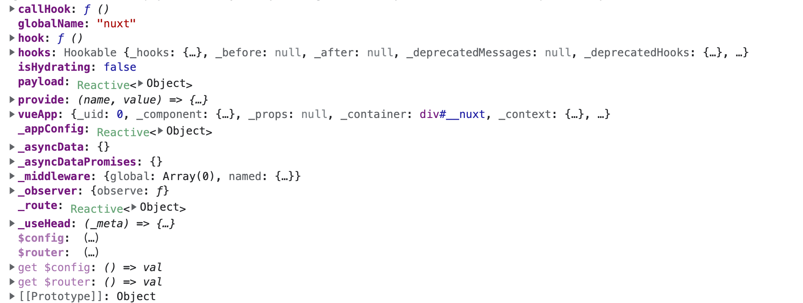

## 插件
### 基本使用
> 插件在plugins目录下，在创建vue app的时候会自动加载
```
    |-- plugins
        |-- myPlugin.ts
```
```js
//myPlugin.ts
export default defineNuxtPlugin(nuxtApp => {
  
})

```
### nuxtApp是什么
> nuxt运行时上下文，client和server都可以访问，可以得到vue实例，运行时hook，运行时配置


### 提供帮助函数
```js
export default defineNuxtPlugin(() => {
  return {
    provide: {
      hello: (msg: string) => `Hello ${msg}!`
    }
  }
})

```
```html
<template>
  <div>
    {{ $hello('world') }}
  </div>
</template>

<script setup lang="ts">
const { $hello } = useNuxtApp()
</script>

```
### 注册vue插件
```js
export default defineNuxtPlugin((nuxtApp) => {
  nuxtApp.vueApp.use(VuePlugin, {})
})

```
### 定义指令
```js
export default defineNuxtPlugin((nuxtApp) => {
  nuxtApp.vueApp.directive('focus', {
    mounted (el) {
      el.focus()
    }
  })
})


```

### 注册hook
```js
export default defineNuxtPlugin((nuxtApp) => {
  nuxtApp.hook('app:mounted',(app) => {
    console.log(app)
  })
})
```
