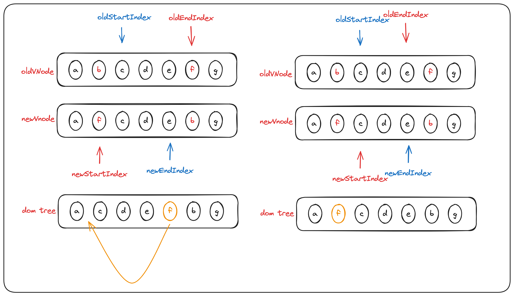

# diff算法

## vue2中的diff算法

### 1. patch方法
::: info 提示
vue2中的diff算法对应源码中[patch](https://github.com/vuejs/vue/blob/bed04a77e575d6c4c1d903f60087dca874f7213e/src/core/vdom/patch.ts#L801)方法
```typescript
return function patch(oldVnode, vnode, hydrating, removeOnly) {
    //新的节点不存在
    if (isUndef(vnode)) {
      if (isDef(oldVnode)) invokeDestroyHook(oldVnode)
      return
    }

    let isInitialPatch = false
    const insertedVnodeQueue: any[] = []
    //旧的节点不存在
    if (isUndef(oldVnode)) {
      // empty mount (likely as component), create new root element
      isInitialPatch = true
      createElm(vnode, insertedVnodeQueue)
    } else {
      const isRealElement = isDef(oldVnode.nodeType)
      //新旧是同一节点
      if (!isRealElement && sameVnode(oldVnode, vnode)) {
        // patch existing root node
        patchVnode(oldVnode, vnode, insertedVnodeQueue, null, null, removeOnly)
      } else {
        //不是同一节点
        if (isRealElement) {
          // mounting to a real element
          // check if this is server-rendered content and if we can perform
          // a successful hydration.
          if (oldVnode.nodeType === 1 && oldVnode.hasAttribute(SSR_ATTR)) {
            oldVnode.removeAttribute(SSR_ATTR)
            hydrating = true
          }
          if (isTrue(hydrating)) {
            if (hydrate(oldVnode, vnode, insertedVnodeQueue)) {
              invokeInsertHook(vnode, insertedVnodeQueue, true)
              return oldVnode
            } else if (__DEV__) {
              warn(
                'The client-side rendered virtual DOM tree is not matching ' +
                  'server-rendered content. This is likely caused by incorrect ' +
                  'HTML markup, for example nesting block-level elements inside ' +
                  '<p>, or missing <tbody>. Bailing hydration and performing ' +
                  'full client-side render.'
              )
            }
          }
          // either not server-rendered, or hydration failed.
          // create an empty node and replace it
          oldVnode = emptyNodeAt(oldVnode)
        }

        // replacing existing element
        const oldElm = oldVnode.elm
        const parentElm = nodeOps.parentNode(oldElm)

        // create new node
        createElm(
          vnode,
          insertedVnodeQueue,
          // extremely rare edge case: do not insert if old element is in a
          // leaving transition. Only happens when combining transition +
          // keep-alive + HOCs. (#4590)
          oldElm._leaveCb ? null : parentElm,
          nodeOps.nextSibling(oldElm)
        )

        // update parent placeholder node element, recursively
        if (isDef(vnode.parent)) {
          let ancestor = vnode.parent
          const patchable = isPatchable(vnode)
          while (ancestor) {
            for (let i = 0; i < cbs.destroy.length; ++i) {
              cbs.destroy[i](ancestor)
            }
            ancestor.elm = vnode.elm
            if (patchable) {
              for (let i = 0; i < cbs.create.length; ++i) {
                cbs.create[i](emptyNode, ancestor)
              }
              // #6513
              // invoke insert hooks that may have been merged by create hooks.
              // e.g. for directives that uses the "inserted" hook.
              const insert = ancestor.data.hook.insert
              if (insert.merged) {
                // start at index 1 to avoid re-invoking component mounted hook
                // clone insert hooks to avoid being mutated during iteration.
                // e.g. for customed directives under transition group.
                const cloned = insert.fns.slice(1)
                for (let i = 0; i < cloned.length; i++) {
                  cloned[i]()
                }
              }
            } else {
              registerRef(ancestor)
            }
            ancestor = ancestor.parent
          }
        }

        // destroy old node
        if (isDef(parentElm)) {
          removeVnodes([oldVnode], 0, 0)
        } else if (isDef(oldVnode.tag)) {
          invokeDestroyHook(oldVnode)
        }
      }
    }

    invokeInsertHook(vnode, insertedVnodeQueue, isInitialPatch)
    return vnode.elm
  }
```
:::
- 新的vnode不存在，表明需要销毁该vnode，直接触发销毁钩子
- 旧的vnode不存在，表明首次创建， 直接创建即可
- 如果oldVnode和vnode是sameVnode则调用patchVnode方法,sameVnode的定义如下
``` ts
function sameVnode(a, b) {
  return (
    a.key === b.key &&
    a.asyncFactory === b.asyncFactory &&
    ((a.tag === b.tag &&
      a.isComment === b.isComment &&
      isDef(a.data) === isDef(b.data) &&
      sameInputType(a, b)) ||
      (isTrue(a.isAsyncPlaceholder) && isUndef(b.asyncFactory.error)))
  )
}
```
- 如果oldVnode和vnode不是sameVnode，则创建新节点，删除旧节点

接下来我们看patchVnode方法是如何处理的

### 2.patchVnode方法
源码如下：
```typescript
function patchVnode(
    oldVnode,
    vnode,
    insertedVnodeQueue,
    ownerArray,
    index,
    removeOnly?: any
  ) {
    if (oldVnode === vnode) {
      return
    }

    if (isDef(vnode.elm) && isDef(ownerArray)) {
      // clone reused vnode
      vnode = ownerArray[index] = cloneVNode(vnode)
    }

    const elm = (vnode.elm = oldVnode.elm)

    if (isTrue(oldVnode.isAsyncPlaceholder)) {
      if (isDef(vnode.asyncFactory.resolved)) {
        hydrate(oldVnode.elm, vnode, insertedVnodeQueue)
      } else {
        vnode.isAsyncPlaceholder = true
      }
      return
    }

    // reuse element for static trees.
    // note we only do this if the vnode is cloned -
    // if the new node is not cloned it means the render functions have been
    // reset by the hot-reload-api and we need to do a proper re-render.
    if (
      isTrue(vnode.isStatic) &&
      isTrue(oldVnode.isStatic) &&
      vnode.key === oldVnode.key &&
      (isTrue(vnode.isCloned) || isTrue(vnode.isOnce))
    ) {
      vnode.componentInstance = oldVnode.componentInstance
      return
    }

    let i
    const data = vnode.data
    if (isDef(data) && isDef((i = data.hook)) && isDef((i = i.prepatch))) {
      i(oldVnode, vnode)
    }

    const oldCh = oldVnode.children
    const ch = vnode.children
    if (isDef(data) && isPatchable(vnode)) {
      for (i = 0; i < cbs.update.length; ++i) cbs.update[i](oldVnode, vnode)
      if (isDef((i = data.hook)) && isDef((i = i.update))) i(oldVnode, vnode)
    }
    //核心逻辑
    if (isUndef(vnode.text)) {
      if (isDef(oldCh) && isDef(ch)) {
        if (oldCh !== ch)
          updateChildren(elm, oldCh, ch, insertedVnodeQueue, removeOnly)
      } else if (isDef(ch)) {
        if (__DEV__) {
          checkDuplicateKeys(ch)
        }
        if (isDef(oldVnode.text)) nodeOps.setTextContent(elm, '')
        addVnodes(elm, null, ch, 0, ch.length - 1, insertedVnodeQueue)
      } else if (isDef(oldCh)) {
        removeVnodes(oldCh, 0, oldCh.length - 1)
      } else if (isDef(oldVnode.text)) {
        nodeOps.setTextContent(elm, '')
      }
    } else if (oldVnode.text !== vnode.text) {
      nodeOps.setTextContent(elm, vnode.text)
    }
    if (isDef(data)) {
      if (isDef((i = data.hook)) && isDef((i = i.postpatch))) i(oldVnode, vnode)
    }
  }
```
- 如果新节点是文本节点,则直接更新dom的内容为新节点的文本内容
- 如果新老节点的子节点都存在，调用updateChildren比较更新子节点
- 如果新节点的子节点存在，老节点的子节点不存在，说明所有节点都是新建的。直接创建dom添加进父节点即可
- 如果新节点的子节点不存在，老节点的子节点存在，说明需要删除,直接删除dom即可

接下来看updateChildren方法

### 3.updateChildren方法
源码如下：
```typescript
  function updateChildren(
    parentElm,
    oldCh,
    newCh,
    insertedVnodeQueue,
    removeOnly
  ) {
    let oldStartIdx = 0
    let newStartIdx = 0
    let oldEndIdx = oldCh.length - 1
    let oldStartVnode = oldCh[0]
    let oldEndVnode = oldCh[oldEndIdx]
    let newEndIdx = newCh.length - 1
    let newStartVnode = newCh[0]
    let newEndVnode = newCh[newEndIdx]
    let oldKeyToIdx, idxInOld, vnodeToMove, refElm

    // removeOnly is a special flag used only by <transition-group>
    // to ensure removed elements stay in correct relative positions
    // during leaving transitions
    const canMove = !removeOnly

    if (__DEV__) {
      checkDuplicateKeys(newCh)
    }

    while (oldStartIdx <= oldEndIdx && newStartIdx <= newEndIdx) {
      if (isUndef(oldStartVnode)) {
        oldStartVnode = oldCh[++oldStartIdx] // Vnode has been moved left
      } else if (isUndef(oldEndVnode)) {
        oldEndVnode = oldCh[--oldEndIdx]
      } else if (sameVnode(oldStartVnode, newStartVnode)) {
        patchVnode(
          oldStartVnode,
          newStartVnode,
          insertedVnodeQueue,
          newCh,
          newStartIdx
        )
        oldStartVnode = oldCh[++oldStartIdx]
        newStartVnode = newCh[++newStartIdx]
      } else if (sameVnode(oldEndVnode, newEndVnode)) {
        patchVnode(
          oldEndVnode,
          newEndVnode,
          insertedVnodeQueue,
          newCh,
          newEndIdx
        )
        oldEndVnode = oldCh[--oldEndIdx]
        newEndVnode = newCh[--newEndIdx]
      } else if (sameVnode(oldStartVnode, newEndVnode)) {
        // Vnode moved right
        patchVnode(
          oldStartVnode,
          newEndVnode,
          insertedVnodeQueue,
          newCh,
          newEndIdx
        )
        canMove &&
          nodeOps.insertBefore(
            parentElm,
            oldStartVnode.elm,
            nodeOps.nextSibling(oldEndVnode.elm)
          )
        oldStartVnode = oldCh[++oldStartIdx]
        newEndVnode = newCh[--newEndIdx]
      } else if (sameVnode(oldEndVnode, newStartVnode)) {
        // Vnode moved left
        patchVnode(
          oldEndVnode,
          newStartVnode,
          insertedVnodeQueue,
          newCh,
          newStartIdx
        )
        canMove &&
          nodeOps.insertBefore(parentElm, oldEndVnode.elm, oldStartVnode.elm)
        oldEndVnode = oldCh[--oldEndIdx]
        newStartVnode = newCh[++newStartIdx]
      } else {
        if (isUndef(oldKeyToIdx))
          oldKeyToIdx = createKeyToOldIdx(oldCh, oldStartIdx, oldEndIdx)
        idxInOld = isDef(newStartVnode.key)
          ? oldKeyToIdx[newStartVnode.key]
          : findIdxInOld(newStartVnode, oldCh, oldStartIdx, oldEndIdx)
        if (isUndef(idxInOld)) {
          // New element
          createElm(
            newStartVnode,
            insertedVnodeQueue,
            parentElm,
            oldStartVnode.elm,
            false,
            newCh,
            newStartIdx
          )
        } else {
          vnodeToMove = oldCh[idxInOld]
          if (sameVnode(vnodeToMove, newStartVnode)) {
            patchVnode(
              vnodeToMove,
              newStartVnode,
              insertedVnodeQueue,
              newCh,
              newStartIdx
            )
            oldCh[idxInOld] = undefined
            canMove &&
              nodeOps.insertBefore(
                parentElm,
                vnodeToMove.elm,
                oldStartVnode.elm
              )
          } else {
            // same key but different element. treat as new element
            createElm(
              newStartVnode,
              insertedVnodeQueue,
              parentElm,
              oldStartVnode.elm,
              false,
              newCh,
              newStartIdx
            )
          }
        }
        newStartVnode = newCh[++newStartIdx]
      }
    }
    if (oldStartIdx > oldEndIdx) {
      refElm = isUndef(newCh[newEndIdx + 1]) ? null : newCh[newEndIdx + 1].elm
      addVnodes(
        parentElm,
        refElm,
        newCh,
        newStartIdx,
        newEndIdx,
        insertedVnodeQueue
      )
    } else if (newStartIdx > newEndIdx) {
      removeVnodes(oldCh, oldStartIdx, oldEndIdx)
    }
  }
```
::: tip 提示
- newStartIndex -> newChildren中所有未处理的第一个节点 
- newEndIndex -> newChildren中所有未处理的最后一个节点
- oldStartIndex -> oldChildren中所有未处理的第一个节点
- oldEndIndex -> oldChildren中所有未处理的最后一个节点


:::
#### 3.1 newStartIndex和oldStartIndex指向的节点是相同节点
处理子节点，然后指针后移，如下图


#### 3.2 newEndIndex和oldEndIndex指向的节点是相同节点
处理子节点，然后指针前移，如下图


#### 3.3 oldStartIndex和newEndIndex指向的节点是相同节点
这种情况除了处理子节点外，还会将oldStartIndex位置所对应的dom节点移动到oldEndIndex位置所对应的dom节点的后面,oldStartIndex指针后移， newEndIndex指针前移

#### 3.3 oldEndIndex和newStartIndex指向的节点是相同节点
这种情况除了处理子节点外，还会将oldEndIndex位置所对应的dom节点移动到oldStartIndex位置所对应的dom节点的前面,newStartIndex指针后移， oldEndIndex指针前移


#### 4.4 不满足上面的条件
暴力乱序，将旧的vnode映射成map {key: index}的形式，用新的vnode去找，
如果没找到，创建新的节点，如果找到了,把节点移动到oldStartVnode前面

#### 4.5 最后剩余新节点
依次插入
#### 4.6 最后剩余旧节点
删除旧节点
