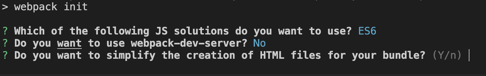
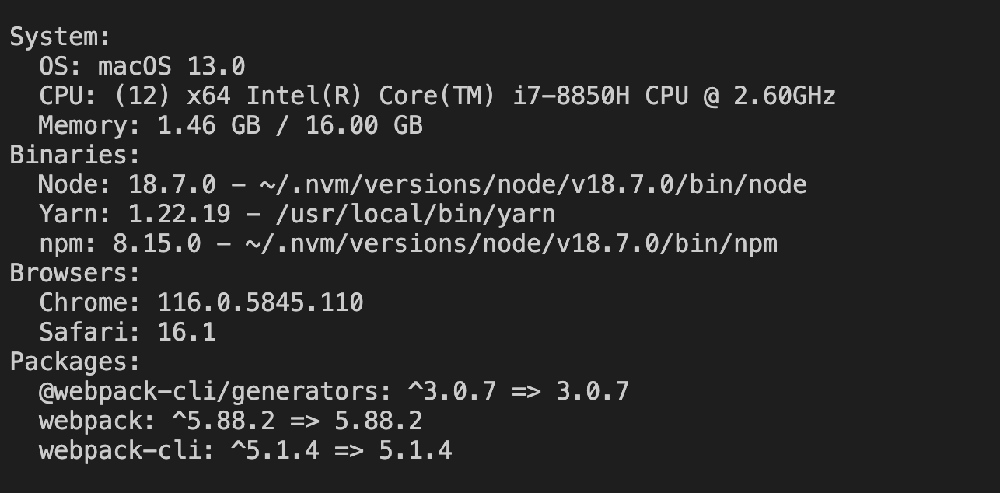
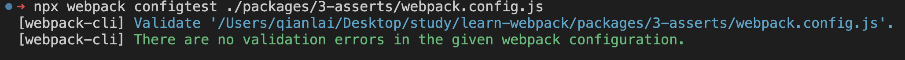

# 命令行接口(CLI)
webpack-cli 提供了许多命令来使 webpack 的工作变得更简单,为了更合适且方便地使用配置，可以在 webpack.config.js 中对 webpack 进行配置。
::: tip
CLI 中传入的任何参数会在配置文件中映射为对应的参数。
:::

## 安装

::: code-group

```sh [npm]
$ npm install webpack webpack-cli --save-dev
```

```sh [yarn]
$ yarn add webpack webpack-cli -D
```

```sh [pnpm]
$ pnpm add webpack webpack-cli -D
```
:::

## 命令

默认情况下，webpack 提供了以下命令：
### init
init命令用来初始化一个新的webpack项目

```sh
  npx webpack init
```
就会出现如下的选项让你选择：


当然，`webpack init`还有其他的参数，详见[@webpack-cli/generators](https://github.com/webpack/webpack-cli/blob/master/packages/generators/INIT.md),这个npm包就是用来生成`webpack`项目的

### build命令
build命令是用来构建，输出文件的,类似于下面这样
```sh
npx webpack build --config ./webpack.prod.config.js --stats verbose
```

### info 命令
info命令是用来查看系统信息的
```sh
 webpack info
```


### configtest命令
configtest 命令是用来校验webpack配置文件的
```sh
npx webpack configtest ./webpack.config.js
```


### serve命令
serve命令是运行`webpack-dev-server`开发服务器
```sh
npx webpack serve --static --open
```
### watch命令
运行 webpack 并且监听文件变化。

```
npx webpack watch
```

## Environment选项
当 webpack 配置导出为函数时，会接收到一个 "environment" 的参数。
```js
module.exports = (env) => {
  
}
```
### env设置
```sh
#env.production = true
npx webpack --env production   
```
可以有多种使用方式，如下：
| 命令                                                       | 解析后的结果                          |
| ---------------------------------------------------------------- | ---------------------------------------------- |
| `npx webpack --env prod`                                         | `{ prod: true }`                               |
| `npx webpack --env platform=app --env production`                | `{ platform: "app", production: true }`        |
| `npx webpack --env foo=bar=app`                                  | `{ foo: "bar=app"}`                            |
| `npx webpack --env app.platform="staging" --env app.name="test"` | `{ app: { platform: "staging", name: "test" }}` |

除了通过`--env`自定义环境变量，webpack还内置了一些env变量,`WEBPACK_SERVE`, `WEBPACK_BUILD`, `WEBPACK_WATCH`，
假设`webpack.config.js`如下

::: code-group
```js [WEBPACK_SERVE]
// webpack serve
module.exports =(env) => {
  //{WEBPACK_SERVE: true}
  console.log(env)
}
```
```js [WEBPACK_BUILD]
// webpack build
module.exports =(env) => {
  //{WEBPACK_BUILD: true}
  console.log(env)
}
```
```js [WEBPACK_WATCH]
// webpack watch
module.exports =(env) => {
  //{WEBPACK_WATCH: true}
  console.log(env)
}
```
:::
### node-env 设置
可以使用 --node-env 选项来设置 `process.env.NODE_ENV`
```sh
npx webpack --node-env production   
# process.env.NODE_ENV = 'production'
```
::: warning
如果不明确的设置 mode，mode 选项的值会被 --node-env 覆盖。
例如 --node-env production 时，会把 process.env.NODE_ENV 和 mode 均设置为 'production'。
:::

### cli中的环境变量
- `WEBPACK_CLI_SKIP_IMPORT_LOCAL` 设置为 true 时将不会使用 webpack-cli 本地实例
- `WEBPACK_CLI_FORCE_LOAD_ESM_CONFIG` 设置为 true 则强制加载 ESM 配置
- `WEBPACK_PACKAGE` 在 CLI 中使用自定义 webpack 版本。
- `WEBPACK_DEV_SERVER_PACKAGE` 在 CLI 中使用自定义 webpack-dev-server 版本
- `WEBPACK_CLI_HELP_WIDTH` 用于帮助输出的自定义宽度。
比如，你可以在运行`webpack`命令时指定不同的版本
```json [package.json]
{
  "webpack": "^4.0.0",
  "webpack-5": "npm:webpack@^5.32.0",
  "webpack-cli": "^4.5.0"
}

```
当你使用v4.0.0时候
```sh
npx webpack
```
当你使用v5的时候
```sh
WEBPACK_PACKAGE=webpack-5 npx webpack
```
