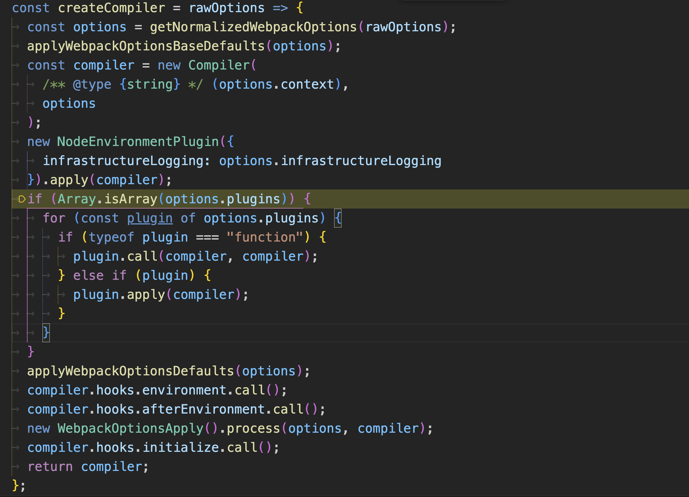
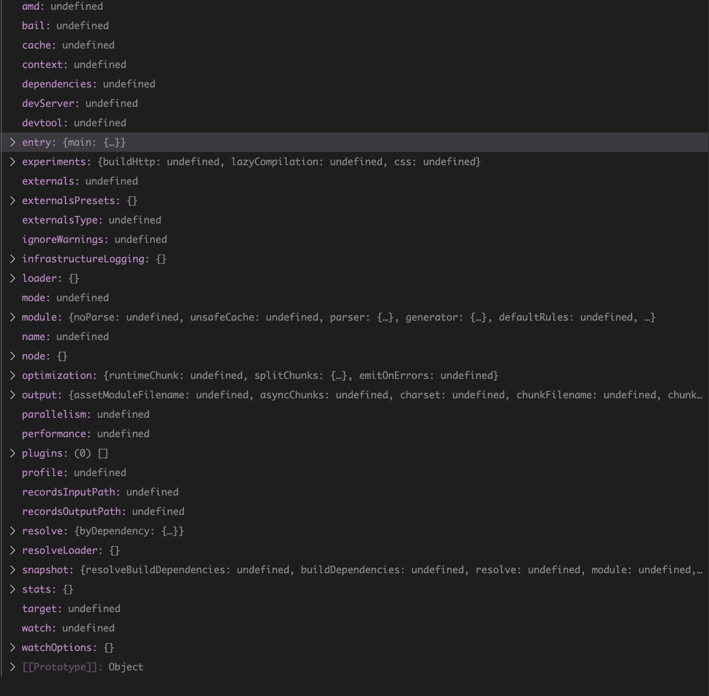
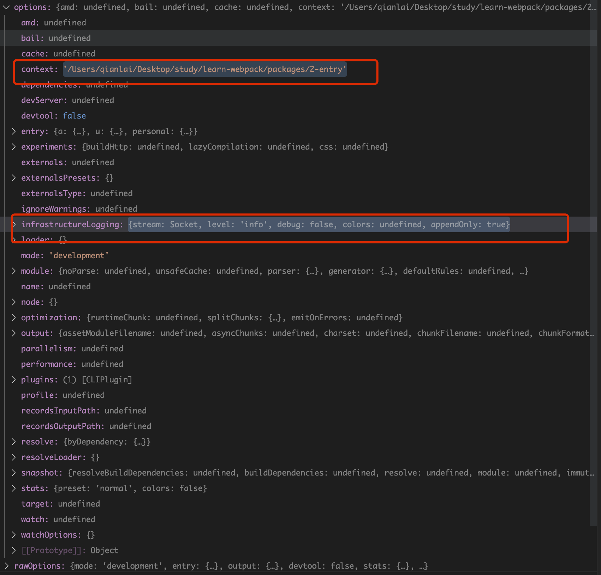
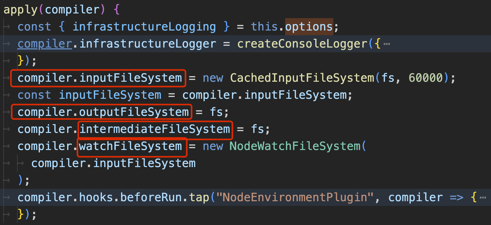
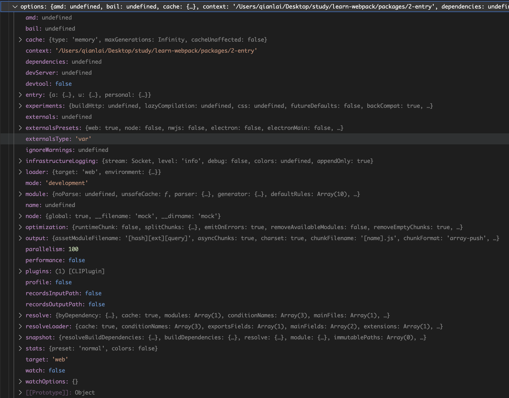
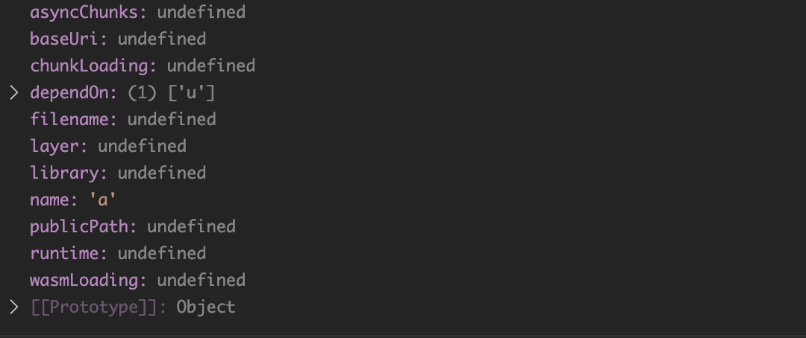

# 源码解析1(创建Compiler对象)
webpack方法运行时，首先会通过createCompiler方法创建Compiler对象,参数`rawOptions`通过命令行或者`webpack.config.js`配置
文件传入的原始配置对象



## 1.标准化webpack配置
`getNormalizedWebpackOptions`方法的作用就是对用户传入的配置标准化成webpack规定的配置，对于用户传入的，就使用用户的，用户没有
传入的就用一些初始值替代，比如`undefined`,`[]`,`{}`,最终生成的配置类似于下面这样:



## 2.对`infrastructureLogging`选项和`context`选项设置默认值
`applyWebpackOptionsBaseDefaults`方法的代码如下，对`infrastructureLogging`选项和`context`选项设置
::: tip
其实后面`applyWebpackOptionsDefaults`方法会对所有的options设置默认值，
这里先对`context`和`infrastructureLogging`选项设置默认值，是因为在后面的
初始化`Compiler`和 `NodeEnvironmentPlugin`插件的调用中使用了`context`和`infrastructureLogging`
:::
```js
const applyWebpackOptionsBaseDefaults = options => {
	F(options, "context", () => process.cwd());
	applyInfrastructureLoggingDefaults(options.infrastructureLogging);
};
```
最终`options对象`如下：


## 3.创建`Compiler`对象
`Compiler`构造函数主要初始化了一些hooks和一些变量，TODO:

## 4.调用`NodeEnvironmentPlugin`内置插件为`Compiler`设置文件系统
`NodeEnvironmentPlugin`是webpack的一个内置插件，主要为`Compiler`对象设置文件系统
主要包含四部分
- inputFileSystem 读文件
- outputFileSystem 写文件
- intermediateFileSystem TODO:
- watchFileSystem 对文件变动监控



## 5.遍历调用所有配置文件中传入的插件

用户配置文件的`plugins`可能会传入一些插件，这里集中对插件进行调用
webpack插件可以是一个function也可以是一个带有apply方法的类,所以这里进行了一次判断
::: code-group
```js [function插件]
function myPlugin(compiler) {
  //do something
}
```
```js [class插件]
class MyPlugin{
  apply(compiler) {
    //do something
  }
}
```
:::
## 6.设置其他默认选项
`applyWebpackOptionsDefaults`方法为选项对象设置默认值，最终的结果如下



## 7.`environment`和`afterEnvironment`钩子函数调用
代码如下：
```js
compiler.hooks.environment.call();
compiler.hooks.afterEnvironment.call();
```
两个钩子函数接连调用，主要是在编译器准备环境时调用，
时机就在配置文件中初始化插件之后。
::: tip
比如 webpack内置插件`WatchIgnorePlugin`就注册了`afterEnvironment`钩子函数,在环境准备完成后
改变`compiler`对象的`watchFileSystem`属性
```js{16}
class WatchIgnorePlugin {
	/**
	 * @param {WatchIgnorePluginOptions} options options
	 */
	constructor(options) {
		validate(options);
		this.paths = options.paths;
	}

	/**
	 * Apply the plugin
	 * @param {Compiler} compiler the compiler instance
	 * @returns {void}
	 */
	apply(compiler) {
		compiler.hooks.afterEnvironment.tap("WatchIgnorePlugin", () => {
			compiler.watchFileSystem = new IgnoringWatchFileSystem(
				compiler.watchFileSystem,
				this.paths
			);
		});
	}
}
```
:::
## 8.WebpackOptionsApply 调用
`WebpackOptionsApply`的`process`方法根据不同的options选项初始化了webpack内置的插件
并且执行了三个钩子函数
1. entryOption,在 webpack 选项中的 entry 被处理过之后调用。
```js
new EntryOptionPlugin().apply(compiler);
compiler.hooks.entryOption.call(options.context, options.entry);
```
::: tip
`EntryOptionPlugin` 和 `DllPlugin`插件注册了entryOption钩子函数
:::
 - EntryOptionPlugin 代码如下
 ```js {14-20}
 class EntryOptionPlugin {
	apply(compiler) {
		compiler.hooks.entryOption.tap("EntryOptionPlugin", (context, entry) => {
			EntryOptionPlugin.applyEntryOption(compiler, context, entry);
			return true;
		});
	}
	static applyEntryOption(compiler, context, entry) {
		if (typeof entry === "function") {
			const DynamicEntryPlugin = require("./DynamicEntryPlugin");
			new DynamicEntryPlugin(context, entry).apply(compiler);
		} else {
			const EntryPlugin = require("./EntryPlugin");
			for (const name of Object.keys(entry)) {
				const desc = entry[name];
				const options = EntryOptionPlugin.entryDescriptionToOptions(
					compiler,
					name,
					desc
				);
				for (const entry of desc.import) {
					new EntryPlugin(context, entry, options).apply(compiler);
				}
			}
		}
	}
}
 ```
 首先在apply方法中注册一个entryOption钩子函数，entryOption钩子函数被调用时
 首先对entry对象做一个标准化，生成的options如下



然后调用了EntryPlugin的apply方法，如下
```js
class EntryPlugin {
	constructor(context, entry, options) {
		this.context = context;
		this.entry = entry;
		this.options = options || "";
	}

	apply(compiler) {
    //注册compilation钩子函数
		compiler.hooks.compilation.tap(
			"EntryPlugin",
			(compilation, { normalModuleFactory }) => {
				compilation.dependencyFactories.set(
					EntryDependency,
					normalModuleFactory
				);
			}
		);

		const { entry, options, context } = this;
		const dep = EntryPlugin.createDependency(entry, options);
    //注册make钩子函数
		compiler.hooks.make.tapAsync("EntryPlugin", (compilation, callback) => {
			compilation.addEntry(context, dep, options, err => {
				callback(err);
			});
		});
	}

	static createDependency(entry, options) {
		const dep = new EntryDependency(entry);
		dep.loc = { name: typeof options === "object" ? options.name : options };
		return dep;
	}
}
```
首先注册了compilation钩子函数，然后生成entry依赖，最后注册make钩子

2. afterPlugins 在初始化内部插件集合完成设置之后调用。
```js
compiler.hooks.afterPlugins.call(compiler);
```
::: tip
`ModuleFederationPlugin`插件注册了afterPlugins钩子函数
:::
3. afterResolvers resolver 设置完成之后触发。
```js
compiler.hooks.afterResolvers.call(compiler);
```


## 9.`initialize`钩子函数调用
当编译器对象被初始化时调用。
```js
compiler.hooks.initialize.call();
```

这样就完成了Compiler对象的创建
