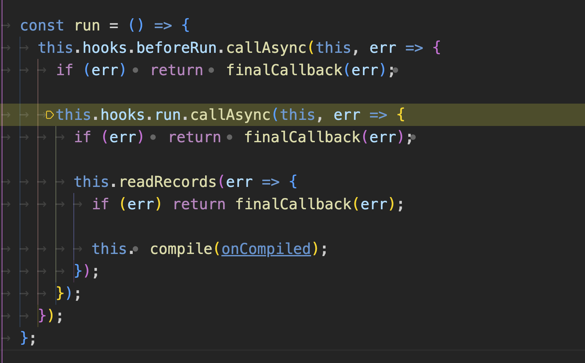

# 源码解析2(Compiler.run)

## 1. 调用beforeRun和run钩子函数
如下：



在 run钩子函数调用完毕后，
首先调用了`readRecords`方法，其作用是读取webpack配置中`recordsInputPath`的路径，用来初始化`Compiler.record`,
大致逻辑如下
``` js {15}
_readRecords(callback) {
		if (!this.recordsInputPath) {
			this.records = {};
			return callback();
		}
		this.inputFileSystem.stat(this.recordsInputPath, err => {
			// It doesn't exist
			// We can ignore this.
			if (err) return callback();

			this.inputFileSystem.readFile(this.recordsInputPath, (err, content) => {
				if (err) return callback(err);

				try {
					this.records = parseJson(content.toString("utf-8"));
				} catch (e) {
					return callback(new Error(`Cannot parse records: ${e.message}`));
				}

				return callback();
			});
		});
	}
```

后面接着调用了`this.compile方法`

## compile方法的调用

compile方法大致做了
- 创建编译参数
- 调用beforeCompile钩子
- 调用compile钩子
- 创建compilation
- make阶段
- 调用finishMake钩子
``` js 
//去掉了不重要的代码
compile(callback) {
    //创建编译参数
		const params = this.newCompilationParams();
    //调用beforeCompile钩子函数
		this.hooks.beforeCompile.callAsync(params, err => {
			if (err) return callback(err);
    //调用compile钩子函数
			this.hooks.compile.call(params);
      //创建compilation对象
			const compilation = this.newCompilation(params);
      //调用make钩子
			this.hooks.make.callAsync(compilation, err => {
				if (err) return callback(err);
        //调用finish钩子
				this.hooks.finishMake.callAsync(compilation, err => {
					if (err) return callback(err);

					process.nextTick(() => {
						compilation.finish(err => {
							if (err) return callback(err);
							compilation.seal(err => {
								if (err) return callback(err);
								this.hooks.afterCompile.callAsync(compilation, err => {
									if (err) return callback(err);
									return callback(null, compilation);
								});
							});
						});
					});
				});
			});
		});
	}
```

compile方法的逻辑比较复杂，下面我们继续它的执行逻辑
